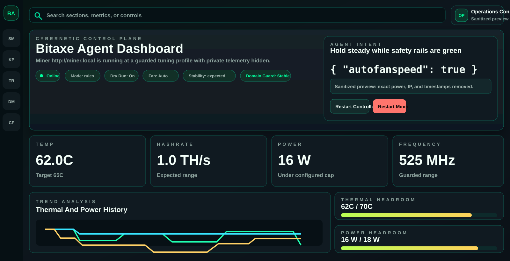

# Bitaxe Agent

Guarded Bitaxe controller that polls AxeOS and adjusts frequency, core voltage, and fan settings in small steps. It is designed to keep the miner inside explicit thermal and electrical limits first, then push upward only when there is headroom.



Two modes are supported:

- `rules`: local control loop with no external AI dependency
- `openai`: asks an LLM for the next action, but still enforces the same hard safety rails

The controller can tune in two styles:

- custom numeric steps via `BITAXE_FREQ_STEP` and `BITAXE_VOLTAGE_STEP`
- ASIC option stepping via `BITAXE_USE_ASIC_OPTIONS=true`

It also keeps a local learning file. The learning layer records observed frequency/core-voltage pairs, marks them stable or unstable against your guardrails, scores them using 10-minute hashrate plus efficiency, remembers the best safe setting, and avoids retrying settings that repeatedly failed.

## What it talks to

This controller targets the AxeOS API exposed by `bitaxeorg/ESP-Miner`:

- `GET /api/system/info`
- `GET /api/system/asic`
- `PATCH /api/system`

The upstream ESP-Miner README documents those endpoints and points to `main/http_server/openapi.yaml` for the full schema.

## Safety model

This is not an unrestricted autotuner.

- It only changes one step at a time.
- It enforces min/max frequency and voltage.
- It clamps operator and AI tuning rails to code-level absolute caps.
- It applies emergency rollback if thermal limits are exceeded.
- It raises fan speed before pushing performance.
- It waits between tuning steps so the miner can settle.
- It learns only from settings that remain inside your configured temperature, power, error-rate, input-voltage, and domain-spread limits.
- It can adapt its cooldown: faster when a setting has stable history and plenty of headroom, slower near heat, power, error, or domain-spread limits.

You should keep `BITAXE_DRY_RUN=true` until you confirm the reported field names and values match your firmware.

## Quick start

1. Copy `.env.example` to `.env`.
2. Set `BITAXE_URL` to your miner, for example `http://192.168.1.50`.
3. Start with conservative limits for your specific board and cooling setup.
4. Run one dry-run pass:

```bash
set -a
source .env
set +a
python3 controller.py --once
```

5. If the state looks correct, keep dry-run on for a few loop cycles:

```bash
set -a
source .env
set +a
python3 controller.py
```

6. Only then set `BITAXE_DRY_RUN=false`.

## Run as services

Both services run on the machine where you install them, not on the Bitaxe itself.

- `bitaxe-agent.service`: the controller loop that polls and tunes the miner
- `bitaxe-agent-ui.service`: the local dashboard on port `8787` by default

The checked-in service files are examples and expect:

- project path: `/home/x/git/bitaxe_agent`
- env file: `/home/x/git/bitaxe_agent/.env`

Portable install for the current checkout:

```bash
chmod +x install_linux.sh
./install_linux.sh
sudo systemctl status bitaxe-agent
sudo systemctl status bitaxe-agent-ui
```

After that, open `http://YOUR-HOST-IP:8787/` in a browser on your LAN.

The installer generates systemd units for the current checkout path, so the folder can be named `bitaxe_agent`, `Bitaxe_agent`, or anything else. It also creates local `status.json` and `learning.json` files if they do not exist.

## AI mode

Set:

- `BITAXE_MODE=openai`
- an AI API key in your private `.env` file
- `AI_MODEL=gpt-4.1-mini` or another Responses API model available to your account

The model does not get direct authority over the miner. It only proposes the next action, and the controller clamps that action to your configured limits. Before calling OpenAI, the controller still runs the local safety guard; emergency thermal, power, error-rate, input-voltage, and domain-instability rollback decisions bypass AI advice.

Example:

```env
BITAXE_MODE=openai
AI_MODEL=gpt-4.1-mini
```

This project calls the OpenAI Responses API directly at `https://api.openai.com/v1/responses`. If you later want a fuller OpenAI Agents SDK integration, keep the same safety split: expose read-only telemetry and a single guarded "propose action" tool, while `controller.py` remains the only code allowed to write to `/api/system`.

## Learning Controls

These values are in `.env.example` and `windows.env.example`:

```env
BITAXE_LEARNING_ENABLED=true
BITAXE_LEARNING_MIN_SAMPLES=3
BITAXE_LEARNING_BAD_LIMIT=2
BITAXE_LEARNING_RESTORE_MARGIN=0.03
BITAXE_LEARNING_EFFICIENCY_WEIGHT=0.25
BITAXE_ADAPTIVE_COOLDOWN_ENABLED=true
BITAXE_ADAPTIVE_MIN_COOLDOWN_SECONDS=45
BITAXE_ADAPTIVE_MAX_COOLDOWN_SECONDS=240
BITAXE_ADAPTIVE_STABLE_SAMPLES=8
BITAXE_LEARNING_FILE=learning.json
```

- `BITAXE_LEARNING_MIN_SAMPLES`: how many stable samples a setting needs before it can become the best-known target.
- `BITAXE_LEARNING_BAD_LIMIT`: how many unstable samples make an unproven candidate blocked.
- `BITAXE_LEARNING_RESTORE_MARGIN`: if current hashrate is worse than the best stable setting by this fraction, the controller steps back toward the best known safe pair.
- `BITAXE_LEARNING_EFFICIENCY_WEIGHT`: how much GH/W contributes to the learned performance score alongside stable 10-minute hashrate.
- `BITAXE_ADAPTIVE_MIN_COOLDOWN_SECONDS`: fastest climb interval when the current setting has stable history and clean headroom.
- `BITAXE_ADAPTIVE_MAX_COOLDOWN_SECONDS`: slowest climb interval near safety limits or after unstable samples.
- `BITAXE_ADAPTIVE_STABLE_SAMPLES`: stable samples required before the controller is allowed to use the fastest climb interval.
- `BITAXE_LEARNING_FILE`: local persistent learning database.

Hard caps are also configured, but the Python controller still enforces conservative built-in ceilings even if `.env` is set higher:

```env
BITAXE_ABSOLUTE_MAX_FREQUENCY=625
BITAXE_ABSOLUTE_MAX_VOLTAGE=1150
BITAXE_ABSOLUTE_MAX_POWER_W=18
BITAXE_CLIMB_POWER_RATIO=0.90
BITAXE_ABSOLUTE_MAX_EMERGENCY_TEMP_C=70
BITAXE_ABSOLUTE_MAX_VR_TEMP_C=75
```

The learning score is risk-adjusted. It rewards stable 10-minute hashrate and GH/W, then subtracts penalties for high power, high fan, high temperature, error rate, and domain imbalance.

`BITAXE_CLIMB_POWER_RATIO` controls how much of the configured power budget may be used before the controller is allowed to raise frequency. For example, `BITAXE_MAX_POWER_W=17.5` and `BITAXE_CLIMB_POWER_RATIO=0.95` gives a climb gate of `16.625W`.

## Operating Profiles

These are starting points, not promises. Cooling, PSU quality, ambient temperature, and board silicon all matter.

| Profile | Max frequency | Max voltage | Cool temp | Max power | Cooldown |
| --- | ---: | ---: | ---: | ---: | ---: |
| Cool | 525 MHz | 1060 mV | 61C | 15.5 W | 240 s |
| Balanced | 535 MHz | 1090 mV | 63C | 16.5 W | 180 s |
| Performance | 575 MHz | 1125 mV | 64C | 17.5 W | 120 s |

The included `.env.example` defaults to the balanced profile with slightly slower domain-spread confirmation, which is a better daily baseline after an overnight run than pushing straight to the highest observed hashrate. The dashboard preset buttons can apply these values to `.env`; restart `bitaxe-agent` after saving.

## Runtime Privacy

The private `.env` file is ignored by Git. Runtime `status.json` is also generated locally and now redacts common sensitive raw telemetry fields such as Wi-Fi identifiers, MAC/IP values, pool usernames, stratum URLs, scripts, certificates, and coinbase output data before the dashboard exposes the raw status panel.

## Notes

- Different AxeOS versions may expose slightly different JSON field names. `controller.py` already checks several common variants, but you should verify one sample response from your device.
- This project is preconfigured for an AxeOS-compatible Bitaxe profile. Replace the sample miner URL and guardrails with values that match your own device before live control.
- The current write mapping uses `frequency`, `coreVoltage`, `fanspeed`, and `autofanspeed` to match that firmware.
- The UI writes safe config edits back to `.env`. Restart `bitaxe-agent` after saving changes so the controller reloads them.
- The safest production pattern is to run this on the same LAN as the miner, behind your firewall, not exposed to the internet.

## Support

If this project helps you keep your miner cooler, safer, or just a little less dramatic, donations are welcome:

```text
BTC: bc1qey94gfjas0hcdj3vh8u56yjx7030j59pyvd4hr
```

## References

- ESP-Miner README: https://github.com/bitaxeorg/ESP-Miner
- AxeOS API/OpenAPI spec: https://raw.githubusercontent.com/bitaxeorg/ESP-Miner/master/main/http_server/openapi.yaml
- OpenAI Responses API: https://platform.openai.com/docs/api-reference/responses
- OpenAI Structured Outputs: https://platform.openai.com/docs/guides/structured-outputs
- OpenAI Agents SDK: https://platform.openai.com/docs/guides/agents-sdk/
